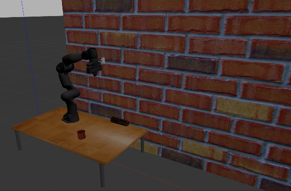

# Franka_simulation
Utility for automatic simulation depth data generation for objects from the [YCB dataset](https://www.ycbbenchmarks.com/object-models/).
Here only four of them are used:
1. Cricket_ball
2. chips_can
3. 025_mug_textured
4. 029_plate_textured

Be sure to add these object models or any other models you want to use in your .gazebo/models folder beforehand.



## Installation

To get started with Franka_simulation:

1. Clone this repository to your ros workspace under /src.
2. Clone the panda_moveit_config from here:
   ```
   https://github.com/tahsinkose/panda_moveit_config.git
   ```
3. Build your ros workspace.

## Usage
- Run the following launch file to run the simulation.
  ```
  roslaunch panda_moveit_config demo_gazebo.launch
  ```
- Then, run the following script to generate images of the objects.
  ```
  rosrun panda_sim spawn_model.py
  ```
- Any changes you need to do for different set of objects can be done in ```spawn_model.py``` file.

## Original Package Attribution
The ```frank_ros``` package of this project is based on the following repository [franka_ros](https://github.com/tahsinkose/franka_ros).

## Modifications

The following modifications have been made to the original package to adapt it to the needs of this project:

- Added the Kinect sensor to the URDF for the depth image capture.
- Configured the ```panda.launch``` file for this specific use case.
  
## Compatibility

This project is compatible with the following environment:

- Operating System: Ubuntu 20.04
- ROS Distribution: Noetic


